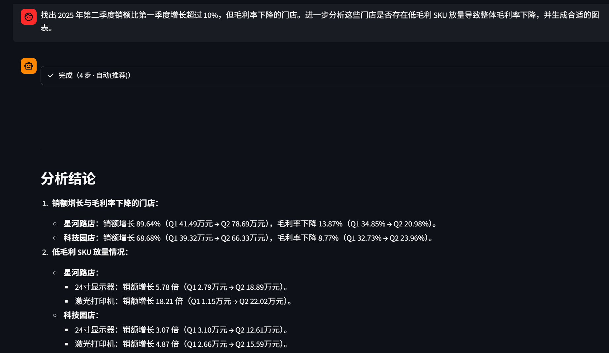
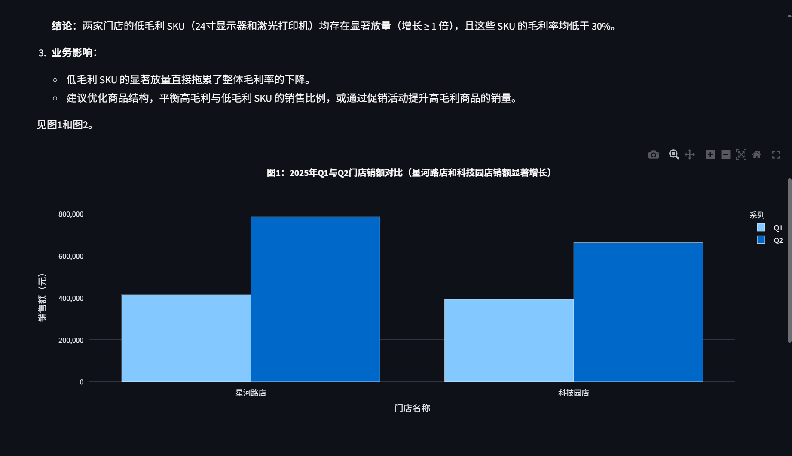
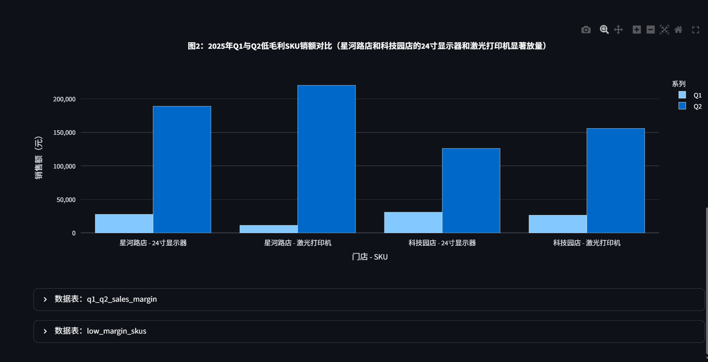

# 自然语言数据分析 Agent 实验报告

## 1. 实验目标与题目要求

本实验要求设计并实现一个零售业务**自然语言数据分析 Agent**：用户用中文提问，系统自动完成理解、只读 SQL 查询、结果分析与绘图。数据侧提供 Excel 与配套 Markdown 说明（字段含义、关联关系、指标口径、业务术语）。

实验需回答并落地以下内容：

- Agent 整体设计思路；
- Markdown 数据说明如何参与自然语言理解与数据查询；
- 大模型使用方式、工作流、提示词/工具设计与结果分析；
- 哪些环节依赖大模型，哪些使用确定性工程；
- 如何搭建可用性较好的工作流，以及本人的优化与改进。

---

## 2. 系统总体架构与 Agent 整体设计思路

### 2.1 技术栈

| 层级 | 技术 | 作用 |
|------|------|------|
| 数据层 | SQLite（`data/retail.db`） | Excel 导入后的维表/事实表 |
| 语义层 | Markdown + Schema Pack | 字段说明、术语映射、指标公式 |
| 推理层 | DeepSeek（七牛 OpenAI 兼容 API） | 规划、写 SQL、写结论 |
| 工具层 | Python Tool Runtime | 执行 SQL、画图、收口 finish |
| 交互层 | Streamlit | 对话、过程展示、图表呈现 |
| 验收层 | `scripts/e2e_examples.py`、`smoke_test.py` | 题目示例批量跑、SQL 层冒烟 |

表结构映射：

| Excel | 表名 |
|-------|------|
| store_info.xlsx | dim_store |
| product_info.xlsx | dim_product |
| sales_order.xlsx | fact_sales |
| refund_record.xlsx | fact_refund |

核心关联键：`store_id` / `product_id` / `order_id`。

### 2.2 Agent 整体设计思路

本 Agent 采用 **「厚领域知识 + 窄工具接口 + 多轮 Function Calling（ReAct）+ 确定性执行层」** 的设计，核心目标是：让用户用中文提问，系统自动完成理解、只读查询、分析与绘图，同时把「容易算错、写错」的环节尽量从模型临场发挥中剥离出来。

#### （1）总原则：大脑与手脚分离

**用大模型做“理解与规划”，用确定性工程做“执行、校验与展示”。**

| 角色 | 负责 | 不负责 |
|------|------|--------|
| 大模型（大脑） | 读题、术语映射、规划步骤、起草 SQL、撰写结论 | 不直接连库、不直接画图、不改写数据库 |
| Tool Runtime（手脚） | 校验并执行只读 SQL、Plotly 画图、缓存结果表、收口 `finish` | 不自行理解用户意图 |
| Schema Pack（说明书） | 把 DDL、指标口径、Markdown、业务术语注入 System Prompt | 不执行任何查询 |
| Streamlit（窗口） | 展示过程、结论与图表 | 不参与推理 |

大模型通过 Function Calling 输出「要调哪个工具、参数是什么」；本地 `ToolRuntime.dispatch` 真正执行后，把结果以 `role=tool` 写回对话，供下一轮继续规划。如此循环，直到模型调用 `finish` 给出最终中文结论。

#### （2）四条支柱

1. **领域知识前置（Schema Pack）**
   启动任务时组装：当前库 DDL + `METRIC_RULES`（销额/毛利率/退损率等硬口径）+ 各表 Markdown + `business_terms.md`。
   口语如「华东战区」「即时零售」「销额」优先按术语表与指标规则落到字段与公式，而不是靠字段名相似度猜测。Markdown 是 Agent 的知识注入，不是给人看的附录。

2. **窄而精的工具集**
   仅暴露 `get_schema` / `run_sql` / `plot_chart` / `analyze_dataframe` / `finish`。
   工具少，模型决策空间收敛；复杂题靠「多轮调用」组合完成（如全量退损率图 → 阈值筛选 → 原因下钻），而不是做一个万能工具。

3. **ReAct 多轮工作流**
   `DataAnalysisAgent.run()` 每轮：LLM 决策 → 产生 `tool_calls` → 本地执行 → 结果回写 → 再决策。
   System Prompt 中固化典型最短路径（如示例 5：筛店 → 画门店对比 → 低毛利 SKU 全量下钻 → 再画图 → `finish`），减少盲目试错。`finish` 由模型在认为任务完成时主动调用；本地可拦截「用户要图却未成功画图就 finish」等情况。

4. **执行层防呆与校验**
   SQL 只读门禁、拒收 WHERE 聚合 / 空 SQL / 乘号丢失、退损率分母错误写法拦截与结果合理性检查、画图图号与「门店-SKU」轴防呆等，均由代码保证。
   工具失败时返回 `error` + `hint`，允许同会话内由模型改 SQL 重试，而不是直接编造数字。

#### （3）端到端数据流（设计视角）

1. 用户中文问题

2. 注入 System Prompt（角色约束 + Schema Pack）
3. 大模型规划并选择工具
4. run_sql：只读查 SQLite，结果进内存
5. （可选）plot_chart：基于结果集画图
6. （可选）再下钻 run_sql
7. finish：输出中文 Markdown 结论
8. Streamlit 展示结论、图表与中间表

#### （4）为何这样设计（相对「纯 LLM 写答案」）

- **可核对**：数字来自 SQL 执行结果，不是模型瞎编一张表；
- **可纠错**：错误 SQL 被门禁或数据库打回后，模型可按 hint 重写；
- **可约束业务**：指标口径、退损率分母、放量判定等写进提示与校验，降低「说法自相矛盾」；
- **可验收**：Web 单题与 `e2e_examples.py` 批量跑同一套 Agent，方便回归题目示例 1–5。

一句话概括：**Agent = 带领域说明书的规划器（LLM）+ 带护栏的执行器（Python/SQLite/Plotly）+ 可观察界面（Streamlit）。**

---

## 3. Markdown 如何参与理解与查询

### 3.1 Schema Pack 组装

启动任务时，`build_schema_pack()` 将下列材料拼成一份注入 System Prompt 的「知识包」：

1. **当前库 DDL**（表/列实况，避免模型臆造字段）；
2. **METRIC_RULES**（成交销额、毛利率、退损率、时间范围、渠道码等硬约定）；
3. **业务 Markdown**：`store_info.md` / `product_info.md` / `sales_order.md` / `refund_record.md`；
4. **术语表**：`business_terms.md`（战区、即时零售、SKU、放量等）。

### 3.2 参与路径（从问句到 SQL）

1. 用户中文问题

2. 术语映射（business_terms：即时零售对应 channel_code='O2O'，战区对应 region 等）
3. 指标口径（销额=quantity*sale_price-discount_amount；毛利率用 unit_cost 等）
4. 选表选字段（DDL + 各表 md 说明关联键）
5. 模型生成只读 SQL，由 run_sql 确定性执行``

示例：

- 「华东战区即时零售」→ `region='华东' AND channel_code='O2O'`（术语 + 字段说明，而非模糊字符串匹配）；
- 「上半年 / Q1 / Q2」→ 统一日期区间（METRIC_RULES 中的时间解析约定）；
- 「退损率」→ `refund_amount / 成交销额`，退款按 `refund_date`、销额按 `order_date`。

**结论：** Markdown 不是给人看的附录，而是 Agent 的**领域知识注入**；没有它，模型容易按字段名猜错口径。

---

## 4. 大模型使用方式

### 4.1 调用形态

- 提供商：七牛兼容 OpenAI Chat Completions；
- 模型：可配置（默认 DeepSeek 系列）；
- 能力：`tools` + `tool_choice=auto`，多轮 Function Calling；
- 温度：分析任务使用 `temperature=0.0`，降低随机性；
- 限速：`fast` / `stable` / `auto` 三档（应对 429 Too Many Requests）。

### 4.2 模型在单题中的角色

一次问答通常包含多轮 LLM 调用，例如：

1. 读题 → 规划 → `run_sql`；
2. 看结果 → `plot_chart`；
3. 下钻再 `run_sql`；
4. 再画图 / `finish` 输出中文结论。

因此：**单题也可能触发限流**；429 时客户端退避重试，表现为变慢，极端情况才整题失败。

### 4.3 Token 与延迟粗评

| 项目 | 观察 |
|------|------|
| Token 大头 | System Schema Pack + 工具定义 + 多轮历史反复输入 |
| 时延大头 | 远端 LLM（本地 SQLite/Plotly 通常 &lt;1s） |
| 并发 | 当前单会话串行 ReAct，非高并发服务 |
| 体感 | 复杂题（示例 5）常见约 1～3 分钟，失败重试会更长 |

---

## 5. Agent 工作流设计（ReAct + Tools）

### 5.1 主循环

`DataAnalysisAgent.run()`：

```
注入 System（含 Schema Pack）+ User Query
loop 最多 N 步:
    LLM 决策 → 产生 tool_calls 或直接文本
    对每个 tool:
        参数解析 / 容错
        业务门禁（如：要图却未画图则拒绝 finish）
        ToolRuntime.dispatch 执行
        把 JSON 结果写回 messages
    若 finish 成功 → 返回 answer + figures + tables
若超步数 → 尝试自动补图并汇总已有结果
```

### 5.2 工具集

| 工具 | 职责 | 确定性程度 |
|------|------|------------|
| `get_schema` | 返回库结构 | 高 |
| `run_sql` | 只读 SQL 执行与结果缓存 | 高（含校验） |
| `plot_chart` | 基于结果集画 bar/line/pie | 高（含推断与防呆） |
| `analyze_dataframe` | 结果摘要辅助分析 | 中高 |
| `finish` | 输出最终中文 Markdown | 低（文案靠模型） |

### 5.3 典型业务最短路径（示例 5）

提示词中固化推荐路径，减少盲目试错：

1. SQL 找出「销额增长且毛利率下降」的门店；
2. 画门店级 Q1/Q2 对比（图 1）；
3. 对目标店做**低毛利 SKU 全量下钻**（Q1∪Q2 并集 + 外层毛利率阈值过滤）；
4. 画门店-SKU 对比（图 2）→ `finish`，按数字判定是否显著放量。

---

## 6. 提示词设计要点

System Prompt 不仅写「你是分析师」，还写入可执行约束：

1. **术语优先**：查 `business_terms`，禁止仅靠字段名相似度；
2. **图表与筛选分离**：全量对比图不能偷偷只画超阈值子集；
3. **图号约定**：`plot_chart` 成功顺序 = 图 1、图 2…；图题写在图内；
4. **放量判定规则**：`(Q2-Q1)/Q1 >= 1` 必须判显著放量；禁止数字与定性自相矛盾；
5. **时间顺序**：写「增长（A→B）」必须 Q1→Q2，禁止写反；
6. **SQL 易错清单**：禁止 WHERE 中写聚合、禁止空 SQL、禁止把 `result_name` 当表、乘号 `*` 不可丢。

提示词的定位：**降低模型自由度中的有害自由度**，把可形式化的业务规则从「临场发挥」变成「硬约束」。

---

## 7. 确定性工程：执行、校验与展示

下列环节**不依赖模型临场正确**，由代码保证：

### 7.1 SQL 安全与语法门禁（`db.py` / `tools.py`）

- 只允许 `SELECT` / `WITH ... SELECT`；拦截写操作；
- 单语句限制；
- **拒收 WHERE 中的 SUM/AVG 等聚合**（提前于 SQLite 报错）；
- **拒收丢失乘号**的写法（如 `quantityfs.sale_price`）；
- 错误返回带 `hint`，引导下一轮改对，而不是空重试。

### 7.2 画图引擎防呆（`plot_chart`）

- 宽表 Q1/Q2 自动 melt 为并排柱；
- 同时存在 `store_name`+`product_name` 时强制「门店 - SKU」横轴，避免只显示店名漏掉商品；
- 自动加「图 N：」标题并写在图内，避免文图编号错位；
- SKU 覆盖不均衡时 warning（并区分「阈值下本来只有 4 行全量」与「真抽样」）。

### 7.3 收口与 UI（`finish` / Streamlit）

- `finish` 兼容多种参数别名，并解包误套的 JSON；
- 要求出图的问题在未成功画图时拒绝 finish；
- 界面按生成顺序展示图 1→图 2；过程步骤可展开；
- 滚动：新提问吸底，用户上翻后停止强制跟随。

### 7.4 依赖大模型 vs 确定性对照表

| 环节 | 主要依赖 |
|------|----------|
| 意图理解、术语选用、SQL 起草、分析叙事、业务建议 | **大模型** |
| 指标公式正确性（执行时）、只读安全、SQL 语法门禁、绘图几何与图号、结果表存储 | **确定性工程** |
| 放量「是否成立」 | **规则写在提示中 + 数字来自 SQL**；最终措辞仍可能被模型写歪，故持续用规则与验收加压 |

---

## 8. 结果分析与验收方法

### 8.1 Web 单次问答

- 适合观察 ReAct 过程、图表与交互；
- 侧边栏可选限速：日常可用「快速」，易 429 时用「稳定/自动」；
- 示例按钮一次跑一题（非批量）。

### 8.2 命令行批量验收

```bash
# 题目示例 1–5（与 Web 侧边栏示例相同）
python scripts/e2e_examples.py --only 1 2 3 4 5
```

批量与 Web 共用同一 `DataAnalysisAgent`，差别在调度与交互，不在两套算法。

### 8.3 示例覆盖能力

| 类型 | 能力点 |
|------|--------|
| 示例 1 | 聚合排序 + 柱图 |
| 示例 2 | 战区/渠道术语 + Top SKU |
| 示例 3 | 退损率全量图 + 阈值下钻原因 |
| 示例 4 | 季度对比 + 增长筛选 |
| 示例 5 | 增长且毛利下降 + 低毛利 SKU 放量归因 + 多图 |

### 8.4 示例 5 运行截图（Web 实测）

题目要求：找出 2025 年 Q2 相对 Q1 销额增长超过 10% 且毛利率下降的门店，进一步分析是否存在低毛利 SKU 放量导致整体毛利率下降，并生成合适图表。

本次 Web 实测约 **4 步**完成（限速模式：自动），结论与库内验算一致：目标门店为星河路店、科技园店；低毛利 SKU（24 寸显示器、激光打印机）均显著放量（增长 ≥ 1 倍）。

**图 8-1　问题与分析结论（文字部分）**



要点摘要：

- 星河路店：销额增长 89.64%（Q1 41.49 万元 → Q2 78.69 万元），毛利率 34.85% → 20.98%；
- 科技园店：销额增长 68.68%（Q1 39.32 万元 → Q2 66.33 万元），毛利率 32.73% → 23.96%；
- 两店低毛利 SKU（显示器、激光打印机）Q1→Q2 均出现数倍至十余倍放量。

**图 8-2　业务影响说明与图 1（门店级 Q1/Q2 销额对比）**



图 1 展示筛出的两家门店 Q1/Q2 销额并排对比，与文字结论中的增长幅度一致；界面按生成顺序引用「见图 1」「见图 2」，图题写在图内。

**图 8-3　图 2（低毛利 SKU「门店 - 商品」对比）与中间结果表**



图 2 横轴为「门店 - SKU」，避免只显示店名而漏掉商品；下方可展开中间结果表（如 `q1_q2_sales_margin`、`low_margin_skus`），便于核对 SQL 产出。该截图体现了本系统「多图有序展示 + SKU 轴防呆 + 结果可追溯」的设计效果。

---

## 9. 可用性工作流：如何把 Agent「用稳」

搭建可用性较好的工作流，本实验采用的是「**窄接口工具 + 厚领域提示 + 执行层防呆 + 可观察验收**」（与第 2.2 节整体设计思路一致）：

1. **知识前置**：Markdown → Schema Pack，减少幻觉表字段；
2. **动作收敛**：少而精的 tools，强制 finish 收口；
3. **失败可修复**：工具返回 `error`+`hint`，允许同会话重试；
4. **展示可核对**：过程日志、图内标题、Q1→Q2 数字可追溯；
5. **回归可重复**：e2e 脚本 + 稳定限速。

---

## 10. 本人优化与改进

在完成题目基本能力之外，针对真实跑题中暴露的问题做了系统性加固，摘要如下。

### 10.1 交互与可视化

- 图号写入图内标题，正文不再维护易错位的「图表展示」清单；
- 多图严格按生成顺序展示，避免「先见图 2」；
- SKU 图强制「门店 - 商品」轴，解决只见店名不见 SKU；
- 自动滚动：新对话跟到底，用户上翻后停止抢焦点。

### 10.2 SQL 与下钻正确性

- 拦截 WHERE 聚合、空 SQL、乘号丢失等高频错误；
- **退损率分母陷阱**：拒收 `FROM fact_refund JOIN fact_sales` 后同时 SUM 退款与销额的错误写法，并对异常高退损率结果做合理性拦截（避免出现 70%+ 假数据）；
- 低毛利下钻改为 **UNION 键 + LEFT JOIN** 全量模板，避免 INNER JOIN 丢「单季有量」SKU；
- 明确低毛利默认阈值 30% 为启发式，可调；本数据下两店低毛利常为打印机/显示器共约 4 行属正常全量。

### 10.3 分析语义一致性

- 放量判定与「增长 N 倍」禁止自相矛盾；
- 去掉「科技园往往不放量」类先验，改为**按本次查询数字**逐店判定；
- 强调金额叙述必须 Q1→Q2，避免「增长却写成大→小」。

### 10.4 工程与运维

- LLM 双限速与 429 退避；
- finish 参数容错与 JSON 解包；
- e2e 批量脚本与结果落盘，便于回归。

这些改进体现的能力点：**Function Calling Agent 工程化、领域知识注入、执行层校验、数据可视化一致性、可观测与可验收。**

---

## 11. 瓶颈与后续优化方向

| 瓶颈 | 说明 | 可能优化 |
|------|------|----------|
| 多轮 LLM | 一题多次往返 | 继续压缩轮次；关键题型模板化 |
| 上下文体积 | Schema Pack 每轮携带 | 分层检索/摘要注入 |
| 结论文案 | 仍可能写反箭头、定性漂移 | finish 后规则校验或「模板填数」 |
| 并发 | 单会话串行 | 若产品化再引入队列与配额 |

---

## 12. 实验结论

1. **设计思路正确性**：以 Markdown+DDL 为语义层、以 ReAct Tool Calling 为控制环、以确定性运行时为护栏，能稳定覆盖题目示例所需的查询、分析与绘图。
2. **Markdown 的关键作用**：把口语术语与指标口径翻译成可执行的字段与公式，是自然语言到 SQL 的桥梁。
3. **人机分工**：LLM 负责理解与规划；工程负责安全执行、校验、可视化与验收——这是可用性的关键。
4. **持续改进**：针对图号错位、SKU 漏展示、SQL 常见坑、放量结论自相矛盾等问题的加固，证明 Agent 系统需要「提示词 + 代码门禁」双轮驱动，而不是只靠模型一次写对。

---

## 附录 A：项目关键路径

| 路径 | 说明 |
|------|------|
| `src/agent.py` | ReAct 主循环与 System Prompt |
| `src/schema_pack.py` | Markdown/DDL/指标规则组装 |
| `src/tools.py` | 工具定义与实现 |
| `src/db.py` | 只读 SQL 与语法门禁 |
| `src/app.py` | Streamlit UI |
| `src/llm.py` | 模型客户端与限速 |
| `scripts/e2e_examples.py` | 题目示例 1–5 批量验收 |
| `scripts/smoke_test.py` | SQL 层冒烟测试 |
| `business_terms.md` 等 | 领域说明 |

## 附录 B：快速运行

```bash
pip install -r requirements.txt
# 配置 .env 中 QINIU_* / LLM_*
python scripts/import_excel.py
streamlit run src/app.py
```

